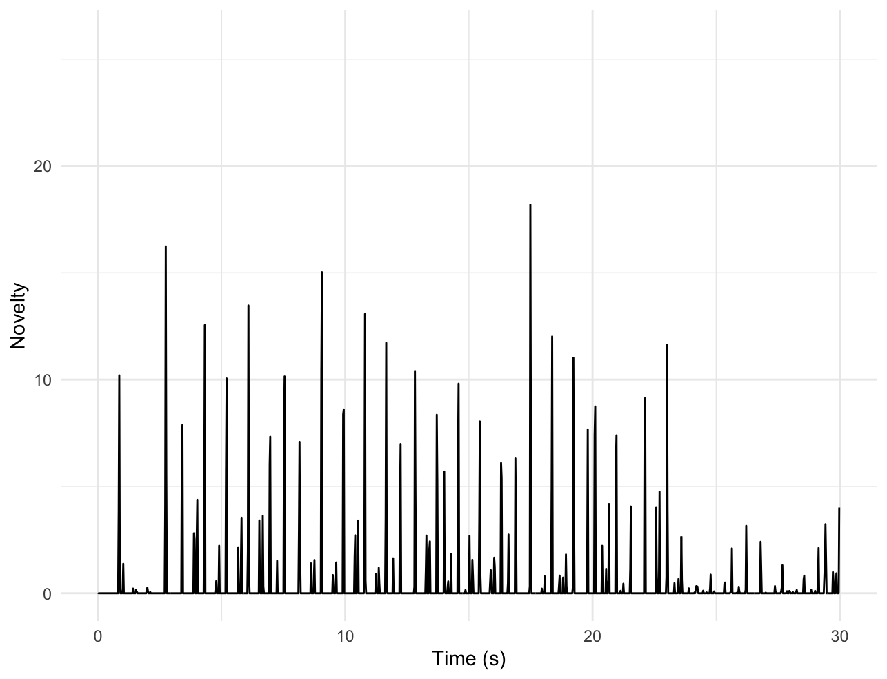
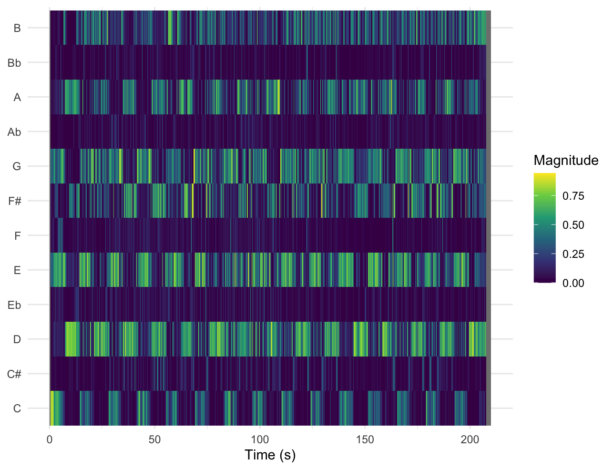
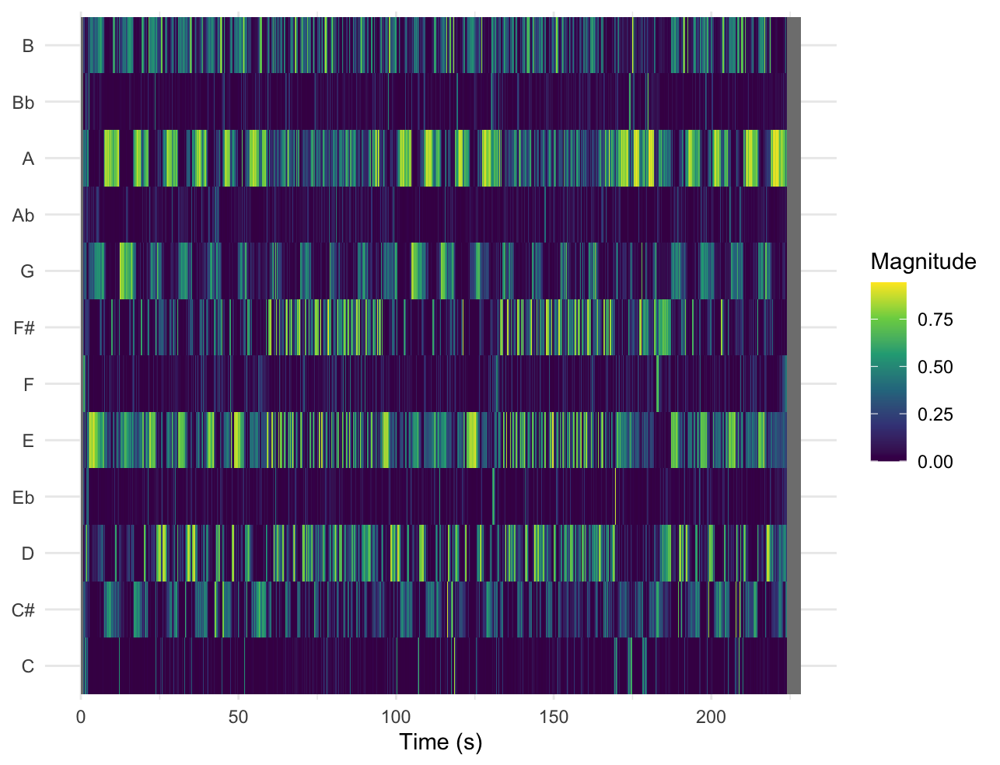

# Description corpus

## Column (width = 30%)

work in progress

# Key and chord estimation

## Column

**Visualisation**

### Row

**Novelty curve Meet me in the hallway**

## Column

### Row

**Interpretation**

work in progress

# Chroma Features

## Column

**Visualisation**

### Row

**Chromagram Golden**

**Chromagram Meet me in the hallway**

## Column

### Row

**Interpretation**

### Row 

*Golden*

In this chromagram of Golden, you can clearly see two patterns alternating. The song begins with a C major (C-E-G) chord, starting at t=0 until t=5. Then, you see the D-F#-A notes light up, which could indicate a D major chord (D-F#-A). This pattern alternates throughout the entire song.

### Row 

*Meet me in the hallway*

In the chromagram of Meet me in the hallway you can see the notes A-C#-E light up which could mean the song is in Amajor.

# Cepstrogram 

## Column

**Visualisation**

### Row

**Cepstrogram Aperture**

## Column

### Row

**Interpretation**

*Aperture*

In the cepstrogram of Aperture , you can see that the greatest change in color is in mfcc_02. From t=0 until t=350, the color of mfcc_02 also changes, indicating a change in magnitude. This shows that the timbre changes throughout the song as the instruments or vocals change. This is consistent with listening to the song, as the magnitude changes as the vocals are added.

# Self-Similarity Matrix

## Column

**Visualisation**

### Row

**Self-Similarity Matrix Aperture**

{width="669"}

## Column

### Row

**Interpretation**

*Aperture*

This SSM shows that the beginning and end of the song have a very different timbre than the rest of the song. For example, from t=0 until t=100 and at t=280 until t=300, a much darker area can be found than in the rest of the song. This is consistent with the song's long intro with a repetitive beat that changes little until the vocals join in at t=100.
